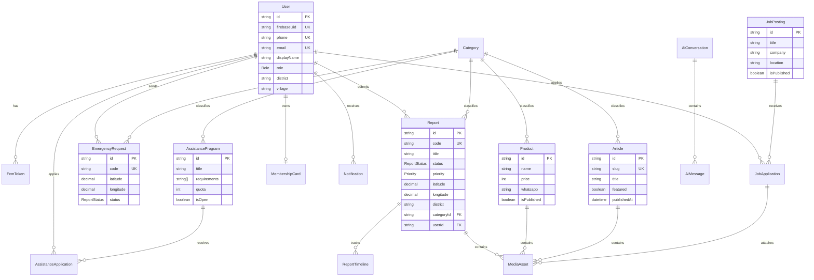

# ERD

```mermaid
erDiagram
  User ||--o{ FcmToken : has
  User ||--o{ Report : submits
  User ||--o{ EmergencyRequest : sends
  User ||--o{ AssistanceApplication : applies
  User ||--o{ JobApplication : applies
  User ||--o| MembershipCard : owns
  User ||--o{ Notification : receives

  Category ||--o{ Report : classifies
  Category ||--o{ EmergencyRequest : classifies
  Category ||--o{ Product : classifies
  Category ||--o{ Article : classifies
  Category ||--o{ AssistanceProgram : classifies

  Report ||--o{ MediaAsset : contains
  Report ||--o{ ReportTimeline : tracks
  Product ||--o{ MediaAsset : contains
  Article ||--o{ MediaAsset : contains
  JobApplication ||--o{ MediaAsset : attaches

  AssistanceProgram ||--o{ AssistanceApplication : receives
  JobPosting ||--o{ JobApplication : receives
  AiConversation ||--o{ AiMessage : contains

  User {
    string id PK
    string firebaseUid UK
    string phone UK
    string email UK
    string displayName
    Role role
    string district
    string village
  }

  Report {
    string id PK
    string code UK
    string title
    ReportStatus status
    Priority priority
    decimal latitude
    decimal longitude
    string district
    string categoryId FK
    string userId FK
  }

  EmergencyRequest {
    string id PK
    string code UK
    decimal latitude
    decimal longitude
    ReportStatus status
  }

  AssistanceProgram {
    string id PK
    string title
    string[] requirements
    int quota
    boolean isOpen
  }

  Product {
    string id PK
    string name
    int price
    string whatsapp
    boolean isPublished
  }

  JobPosting {
    string id PK
    string title
    string company
    string location
    boolean isPublished
  }

  Article {
    string id PK
    string slug UK
    string title
    boolean featured
    datetime publishedAt
  }
```
